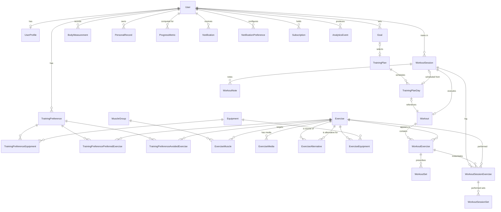

# Backend Data Model — AI Gym Assistant

> **Task:** T-05 (SIW-11) · **Owner:** Backend Lead · **Applies to:** Phase 2–7 backend tasks (T-09, T-12, T-13, T-17, T-21, T-24, T-27, T-31)
> Supersedes nothing. This is the canonical relational schema for the Django backend. PostgreSQL is the only supported production/target database.

---

## 1. Purpose & scope

This document defines the complete relational data model for the AI Gym Assistant backend. It covers every entity
called out in the master instruction SIW-6 §20 (`User`, `UserProfile`, `Goal`, `TrainingPreference`, `Equipment`,
`MuscleGroup`, `Exercise`, `ExerciseMedia`, `ExerciseAlternative`, `TrainingPlan`, `TrainingPlanDay`, `Workout`,
`WorkoutExercise`, `WorkoutSet`, `WorkoutSession`, `WorkoutSessionExercise`, `ProgressMetric`, `BodyMeasurement`,
`PersonalRecord`, `WorkoutNote`, `Notification`) **plus** the phase obligations for subscriptions and analytics, and the
performed-sets table required by the set-tracking workflow (§10/§11), which the §20 list implies but does not name outright.

Design goals:

- **Lean.** No model exists that does not map to a shipped feature in plan §4/§6 (T-13..T-29, T-31).
- **Relational.** All relationships are first-class FKs/M2M with enforced referential integrity, indexes, and constraints.
- **Implementation-ready.** Field names, types, nullability, defaults, constraints, and indexes are specified so that
  T-09/T-12/T-13/T-17/T-21/T-24/T-27 can be written directly against this document.

### Coverage map

| Entity            | App           | Driven by (plan §6 phase)                                                              |
| ----------------- | ------------- | -------------------------------------------------------------------------------------- |
| User              | accounts      | T-13 auth API, T-15/16 onboarding                                                      |
| UserProfile       | profiles      | T-14 profile/onboarding, T-16                                                          |
| Goal              | profiles      | T-14 goals, T-29 dashboard                                                             |
| TrainingPreference| profiles      | T-14 onboarding, T-23 plan selection, T-26 substitution                                |
| Equipment         | content       | T-17 exercise DB, T-12 seed, T-26 substitution                                         |
| MuscleGroup       | content       | T-17 exercise DB                                                                       |
| Exercise          | content       | T-17 exercise DB                                                                       |
| ExerciseMedia     | content       | T-17 media, T-20 media pipeline                                                        |
| ExerciseAlternative| content      | T-17 alternatives, T-26 substitution                                                    |
| TrainingPlan      | training      | T-21 plans API, T-22 seed                                                              |
| TrainingPlanDay   | training      | T-21 plans API, T-22 seed, T-23 plan display                                           |
| Workout           | training      | T-21 plans API, T-22 seed                                                              |
| WorkoutExercise   | training      | T-21 plans API, T-22 seed                                                              |
| WorkoutSet        | training      | T-21 plans API, T-22 seed (prescribed template sets)                                   |
| WorkoutSession    | sessions      | T-24 session/set API, T-25 workout screen, T-28 history/calendar                       |
| WorkoutSessionExercise | sessions  | T-24 session/set API, T-25                                                            |
| WorkoutSessionSet | sessions      | T-24 set logging, T-25 previous-performance                                            |
| WorkoutNote       | sessions      | T-24 notes, T-28 history                                                               |
| BodyMeasurement   | progress      | T-27 measurements                                                                      |
| PersonalRecord    | progress      | T-27 PRs                                                                               |
| ProgressMetric    | progress      | T-27 metrics, T-29 dashboard                                                           |
| Notification      | notifications | T-24+ notifications (backlog), phase hooks                                             |
| NotificationPreference | notifications | notifications opt-in                                                              |
| Subscription      | accounts      | future subscriptions/plans (architecture-ready, no UI now)                             |
| AnalyticsEvent    | analytics     | future analytics (architecture-ready, no UI now)                                       |

---

## 2. Conventions

- **Primary keys:** `BigAutoField` (`id: bigint`). No UUID PKs unless a requirement demands collision-free client ids;
  none does for MVP. Synthetic ids keep FKs small and joins fast.
- **Timestamps:** every mutable entity carries `created_at` and `updated_at` (both `timestamptz`, server defaults
  `now()`). `updated_at` is refreshed via Django `auto_now` semantics.
- **Timezone:** all times stored in **UTC** (`USE_TZ=True`, Postgres `timestamptz`). Clients render in local time.
- **Soft delete:** not used. Delete is destructive (content) or status-based (sessions/plans). No `is_active` burying.
- **Deletion semantics:** user-scoped data keeps the `CASCADE` since a deleted account is legally removable (GDPR-style);
  content rows (Exercise, Equipment, …) use `PROTECT`/`RESTRICT` so history and plans are never orphaned.
- **Names:** `snake_case`, singular tables, FK columns `{related}_id`. Through-tables named after both sides.
- **Default ordering:** `-created_at` for user data, explicit `order`/`day_number`/`set_number` integer fields for
  sequence-sensitive content.
- **Validation:** enforced at the model (`CheckConstraint`, `UniqueConstraint`) **and** serializer level; the DB is the
  final arbiter.

---

## 3. ERD



### Graph (text) — automated rendering above; the graph is normative.

---

## 4. Entity reference

### 4.1 accounts — `User` (custom user model)

Replaces Django's `AbstractUser`. **Defined in `accounts/` before the first migration** (T-09).

| Field                   | Type                        | Null | Default            | Notes                                                                  |
| ----------------------- | --------------------------- | ---- | ------------------ | ---------------------------------------------------------------------- |
| id                      | bigint PK                   | no   | auto               |                                                                        |
| email                   | citext / varchar(254)       | no   | —                  | **unique** (case-insensitive via `CIEmailField`), login identifier      |
| password                | varchar(128)                | no   | —                  | Django `make_password` hash                                            |
| first_name              | varchar(150)                | no   | ""                 |                                                                        |
| last_name               | varchar(150)                | no   | ""                 |                                                                        |
| is_active               | bool                        | no   | true               |                                                                        |
| is_staff                | bool                        | no   | false              | admin access                                                           |
| is_superuser            | bool                        | no   | false              |                                                                        |
| accepted_terms_version  | varchar(20)                 | yes  | null               | set at registration; required to use app                               |
| accepted_terms_at       | timestamptz                 | yes  | null               | audit timestamp for §5 terms                                            |
| date_joined             | timestamptz                 | no   | now                |                                                                        |
| last_login              | timestamptz                 | yes  | null               | Django-managed                                                         |
| created_at / updated_at | timestamptz                 | no   | now                |                                                                        |

**Constraints**
- `UniqueConstraint(email)` (validated on the model — one normalized account per email).
- `CheckConstraint(accepted_terms_version != '' OR is_staff)` (staff may skip terms; regular accounts must accept).

**Relationships**
- 1:1 → `UserProfile` (CASCADE), 1:N → `Goal`, `TrainingPreference`, `WorkoutSession`, `BodyMeasurement`,
  `PersonalRecord`, `ProgressMetric`, `Notification`, `NotificationPreference`, `Subscription`, `AnalyticsEvent`.

**Indexes**
- unique `uq_users_email` on `email`.
- `idx_users_active` on `(is_active)` partial `WHERE is_active` (admin/filter scans).
- `idx_users_joined` on `(date_joined)` for admin analytics.

**Notes**
- Login/logout/refresh are handled by `djangorestframework-simplejwt`; refresh token blacklisting uses the
  `rest_framework_simplejwt.token_blacklist` app (table `blacklistedtoken` maintained by the library, not by us).
- Password reset/change use out-of-band signed tokens (django `PasswordResetTokenGenerator` / DRF endpoints);
  **no** reset token row is stored.

---

### 4.2 accounts — `Subscription`

Future `subscriptions/plans` (§3 "Subscription" breadth). Model the contract now; no billing UI or payments in MVP.

| Field      | Type             | Null | Default | Notes                                     |
| ---------- | ---------------- | ---- | ------- | ----------------------------------------- |
| id         | bigint PK        | no   |         |                                           |
| user       | FK → User        | no   |         | on_delete=CASCADE                         |
| plan       | enum             | no   | free    | `free`, `plus`, `pro`                       |
| status     | enum             | no   | trialing| `trialing`, `active`, `past_due`, `cancelled`, `expired` |
| starts_at  | date             | no   |         |                                           |
| ends_at    | date             | yes  | null    | null = indefinite (free)                  |
| cancelled_at | timestamptz    | yes  | null    |                                          |
| created_at | timestamptz      | no   | now     |                                           |

**Constraints/Indexes**
- `CheckConstraint(ends_at IS NULL OR ends_at >= starts_at)`.
- `idx_subscriptions_user_status` on `(user_id, status)` (active-subscription lookup is hot for analytics gating).
- One `active`/`trialing` subscription per user enforced in the service layer (not DB) to allow flexible plan math.

---

### 4.3 profiles — `UserProfile`

Onboarding/basic profile (§5). One row per user, created on registration, extended during onboarding (T-14).

| Field            | Type                     | Null | Default | Notes                                              |
| ---------------- | ------------------------ | ---- | ------- | -------------------------------------------------- |
| id               | bigint PK                | no   |         |                                                      |
| user             | FK → User (unique)       | no   |         | on_delete=CASCADE                                    |
| date_of_birth    | date                     | yes  | null    | age-derived; no free-text age                       |
| gender           | enum                     | yes  | null    | `female`, `male`, `other`, `prefer_not_to_say`      |
| height_cm        | decimal(5,2)             | yes  | null    | 30–280 cm range check                              |
| current_weight_kg| decimal(5,2)             | yes  | null    | snapshot used at onboarding; ongoing → BodyMeasurement |
| fitness_level    | enum                     | yes  | null    | `beginner`, `intermediate`, `advanced`              |
| training_experience | enum                  | yes  | null    | `none`, `less_than_1y`, `1_3y`, `3_plus_y`          |
| training_frequency_weekly | smallint       | yes  | null    | 0–7                                                 |
| preferred_location | enum                  | yes  | null    | `gym`, `home`, `outdoor`, `mix`                     |
| onboarding_completed_at | timestamptz     | yes  | null    | null until T-16 onboarding flow finishes            |
| created_at / updated_at | timestamptz     | no   | now     |                                                     |

**Constraints/Indexes**
- `CheckConstraint(height_cm BETWEEN 30 AND 280)`; `CheckConstraint(weight BETWEEN 30 AND 400)`.
- `CheckConstraint(training_frequency_weekly BETWEEN 0 AND 7)`.
- unique FK `uq_profiles_user`.
- `idx_profiles_fitness_level` (segmentation for plan recommendation).

---

### 4.4 profiles — `Goal`

User-selected objective (§6). Active goal drives dashboard + plan recommendation (T-14/T-29). One active goal is
typical (service-enforced), history preserved.

| Field        | Type             | Null | Default   | Notes                                          |
| ------------ | ---------------- | ---- | --------- | ---------------------------------------------- |
| id           | bigint PK        | no   |           |                                                |
| user         | FK → User        | no   |           | on_delete=CASCADE                              |
| type         | enum             | no   |           | §6 objective list (below)                       |
| title        | varchar(120)     | yes  | null      | free-form override (optional)                  |
| target_value | decimal(10,2)    | yes  | null      | e.g. 70 kg bodyweight target                    |
| target_unit  | enum             | yes  | null      | `kg`, `lb`, `cm`, `minutes`, `percentage`, `none` |
| start_date   | date             | no   | today     |                                                |
| target_date  | date             | yes  | null      |                                                |
| status       | enum             | no   | active    | `active`, `achieved`, `abandoned`              |
| completed_at | timestamptz      | yes  | null      | set when achieved                              |
| selected_plan| FK → TrainingPlan | yes | null     | plan chosen against this goal (T-23)           |
| created_at / updated_at | timestamptz | no | now    |                                                |

**Constraints/Indexes**
- `CheckConstraint(target_value IS NULL OR target_value > 0)`.
- `CheckConstraint(target_date IS NULL OR target_date >= start_date)`.
- `idx_goals_user_status` on `(user_id, status)`; partial unique `(user_id) WHERE status = 'active'` (**one active
  goal per user at the DB level**).

---

### 4.5 profiles — `TrainingPreference`

§6 training preferences; consumed by plan recommendation (T-23) and substitution (T-26). One row per user.

| Field          | Type             | Null | Default | Notes                                          |
| -------------- | ---------------- | ---- | ------- | ---------------------------------------------- |
| id             | bigint PK        | no   |         |                                                |
| user           | FK → User (unique)| no  |         | on_delete=CASCADE                              |
| days_per_week  | smallint         | yes  | null    | 0–7                                            |
| session_duration_minutes | smallint | yes | null | preferred workout length                     |
| preferred_time_of_day | enum      | yes  | null    | `morning`, `afternoon`, `evening`, `any`       |
| experience     | enum             | yes  | null    | mirrors UserProfile (kept here for preference snapshot semantics) — **set null; do NOT duplicate in MVP; read from UserProfile** |
| note           | varchar(500)     | yes  | null    | free text                                       |
| created_at / updated_at | timestamptz | no | now   |                                                |

**M2M through tables**
- `TrainingPreferenceEquipment(preference FK, equipment FK)` — equipment the user actually has (§5 "available equipment").
- `TrainingPreferencePreferredExercise(preference FK, exercise FK)` — exercises the user likes.
- `TrainingPreferenceAvoidedExercise(preference FK, exercise FK)` — exercises/limitations to avoid (§6 limitations).

**Constraints/Indexes**
- `CheckConstraint(days_per_week BETWEEN 0 AND 7)`.
- Unique tuples on each through table `(preference_id, equipment_id)` etc.
- `idx_preferences_equipment_equipment` on the equipment FK — substitution scans committed equipment (T-26).

---

### 4.6 content — `Equipment`

§8/§9 machine + gear catalog. Data-driven (seeded T-12, admin-editable T-18), never hardcoded in Flutter.

| Field   | Type             | Null | Default | Notes                                |
| ------- | ---------------- | ---- | ------- | ------------------------------------ |
| id      | bigint PK        | no   |         |                                      |
| name    | varchar(120)     | no   |         | unique (e.g. "Barbell", "Leg Press") |
| slug    | varchar(120)     | no   |         | unique, URL-safe                     |
| category| enum             | no   | free    | `free`, `barbell`, `dumbbell`, `machine`, `cable`, `kettlebell`, `band`, `cardio`, `bodyweight`, `other` |
| description | text        | yes  | null    | §9 machine description / setup glue  |
| image   | FK → ExerciseMedia | yes | null   | machine image (media table)          |
| created_at / updated_at | timestamptz | no | now |                                      |

**Indexes:** `idx_equipment_category` on `(category)`.

---

### 4.7 content — `MuscleGroup`

§20 `MuscleGroup`. Filter dimension + substitution driver.

| Field   | Type             | Null | Default | Notes                          |
| ------- | ---------------- | ---- | ------- | ------------------------------ |
| id      | bigint PK        | no   |         |                                |
| name    | varchar(80)      | no   |         | unique                         |
| slug    | varchar(80)      | no   |         | unique                         |
| region  | enum             | no   |         | `chest`, `back`, `shoulders`, `arms`, `legs`, `core`, `full_body`, `other` |
| parent  | FK → MuscleGroup | yes  | null    | hierarchical (e.g. "biceps" under "arms"); self-FK PROTECT |
| created_at / updated_at | timestamptz | no | now |                             |

**Indexes:** `idx_muscles_region` on `(region)`.

---

### 4.8 content — `Exercise` and through tables

The core content entity (§8). Seeded (T-12), admin-editable (T-18).

| Field               | Type             | Null | Default | Notes                                              |
| ------------------- | ---------------- | ---- | ------- | -------------------------------------------------- |
| id                  | bigint PK        | no   |         |                                                    |
| name                | varchar(150)     | no   |         | unique                                             |
| slug                | varchar(180)     | no   |         | unique                                             |
| description         | text             | yes  | null    |                                                    |
| instructions        | text             | yes  | null    | step-by-step how-to (§8)                           |
| difficulty          | enum             | no   | beginner| `beginner`, `intermediate`, `advanced`             |
| movement_type       | enum             | no   | compound| `compound`, `isolation`                            |
| pattern             | enum             | no   |         | `push`, `pull`, `squat`, `hinge`, `lunge`, `carry`, `core`, `cardio`, `static`, `none` — substitution driver |
| primary_focus       | FK → MuscleGroup | no   |         | main muscle target (denormalized for fast filters) |
| mechanics           | enum             | no   |         | `barbell`, `dumbbell`, `machine`, `cable`, `bodyweight`, `kettlebell`, `band`, `other` |
| is_public           | bool             | no   | true    | hide unpublished/draft content                     |
| rep_guidance        | varchar(50)      | yes  | null    | e.g. "8–12"                                        |
| set_guidance        | varchar(50)      | yes  | null    | e.g. "3–4"                                         |
| rest_guidance_seconds | smallint       | yes  | null    |                                                    |
| safety_notes        | text             | yes  | null    | (§8) no medical claims                             |
| created_by          | FK → User        | yes  | null    | content admin (audit), SET_NULL                    |
| created_at / updated_at | timestamptz   | no   | now     |                                                    |

**Through / related tables**

- `ExerciseMuscle(muscle FK → MuscleGroup, exercise FK → Exercise, role enum: primary|secondary|antagonist)`.
  One `role='primary'` row must exist (validated at create); `Exercise.primary_focus` mirrors it for cheap filtering.
- `ExerciseEquipment(exercise FK, equipment FK)` — equipment required/used by the exercise.
- `ExerciseMedia` (see 4.9).
- `ExerciseAlternative` (see 4.10).

**Constraints/Indexes**
- unique `(name)`, unique `(slug)`.
- partial unique `(exercise_id, muscle_id) WHERE role='primary'` (a muscle cannot be primary twice for one exercise).
- `idx_exercises_difficulty`, `idx_exercises_pattern`, `idx_exercises_movement_type`.
- `idx_exercise_muscles_muscle` (filter by muscle), `idx_exercise_equipment_equipment` (filter by equipment).
- Full-text search: `GinIndex` on `to_tsvector('english', name || ' ' || COALESCE(description,''))` — exercise search
  (T-17) uses `SearchVector`/`SearchRank`; fallback `pg_trgm` trigram index on `name` for typo-tolerant prefix search.

---

### 4.9 content — `ExerciseMedia`

§8/§9 images/videos incl. machine media and licensed source tracking (T-20 licensing requirement).

| Field        | Type            | Null | Default | Notes                                            |
| ------------ | --------------- | ---- | ------- | ------------------------------------------------ |
| id           | bigint PK       | no   |         |                                                  |
| exercise     | FK → Exercise   | yes  | null    | null allows reuse for equipment/machine media (4.6 `image`) |
| media_type   | enum            | no   | image   | `image`, `video`                                  |
| url          | varchar(500)    | no   |         | CDN/object-storage URL (never base64 in DB)      |
| alt_text     | varchar(255)    | yes  | null    | accessibility                                    |
| is_primary   | bool            | no   | false   | thumbnail                                        |
| sort_order   | smallint        | no   | 0       | display order                                    |
| license      | enum            | yes  | null    | `cc0`, `cc_by`, `cc_by_sa`, `own`, `purchased`, `unspecified` (T-20) |
| source_author| varchar(255)    | yes  | null    | attribution (T-20)                               |
| source_url   | varchar(500)    | yes  | null    | attribution (T-20)                               |
| created_at   | timestamptz     | no   | now     |                                                  |

**Indexes:** `idx_media_exercise_type` on `(exercise_id, media_type)`; partial unique `(exercise_id) WHERE is_primary`.

---

### 4.10 content — `ExerciseAlternative`

Substitution graph (§16, T-26). Directed relationship `exercise → alternative`.

| Field       | Type              | Null | Default | Notes                                        |
| ----------- | ----------------- | ---- | ------- | -------------------------------------------- |
| id          | bigint PK         | no   |         |                                              |
| exercise    | FK → Exercise     | no   |         | source; PROTECT                              |
| alternative | FK → Exercise     | no   |         | target; PROTECT; `alternative != exercise`   |
| rationale   | enum              | no   | same_muscle | `same_muscle`, `same_pattern`, `same_equipment`, `easier`, `harder` |
| priority    | smallint          | no   | 100     | lower = preferred suggestion                 |
| created_at  | timestamptz       | no   | now     |                                              |

**Constraints/Indexes**
- `CheckConstraint(exercise_id != alternative_id)` — no self-loop.
- Partial unique `(exercise_id, alternative_id, rationale)` (dedupe per rationale).
- `idx_alternatives_exercise` on `(exercise_id)`; `idx_alternatives_alternative` on `(alternative_id, rationale)`
  (reverse suggestions and rationale-scoped substitution).

---

### 4.11 training — `TrainingPlan`

§7/§20 plans are fully data-driven (T-21 API, T-22 seed).

| Field                  | Type            | Null | Default | Notes                                       |
| ---------------------- | --------------- | ---- | ------- | ------------------------------------------- |
| id                     | bigint PK       | no   |         |                                             |
| name                   | varchar(150)    | no   |         | unique                                      |
| slug                   | varchar(180)    | no   |         | unique                                      |
| description            | text            | yes  | null    |                                             |
| objective              | enum            | no   | general | `lose_weight`, `build_muscle`, `gain_strength`, `endurance`, `fitness`, `body_composition`, `general_health`, `maintain` |
| difficulty             | enum            | no   | beginner | `beginner`, `intermediate`, `advanced`      |
| duration_weeks         | smallint        | yes  | null    | plan cycle                                  |
| days_per_week          | smallint        | no   | 3       | 1–7                                         |
| is_active              | bool            | no   | true    | publish flag                                |
| created_at / updated_at| timestamptz     | no   | now     |                                             |

**Constraints/Indexes**
- `CheckConstraint(days_per_week BETWEEN 1 AND 7)`.
- `idx_plans_active` partial `(id) WHERE is_active`.
- `idx_plans_objective` on `(objective)`.

---

### 4.12 training — `TrainingPlanDay`

Ordered day slot (workout schedule). Week-over-week rotation is modeled by adding more days/rows if needed (lean MVP).

| Field     | Type                 | Null | Default | Notes                                  |
| --------- | -------------------- | ---- | ------- | -------------------------------------- |
| id        | bigint PK            | no   |         |                                        |
| plan      | FK → TrainingPlan    | no   |         | CASCADE                                |
| day_number| smallint             | no   |         | 1-based, unique within plan            |
| name      | varchar(120)         | yes  | null    | e.g. "Day 1 — Push"                     |
| workout   | FK → Workout         | no   |         | PROTECT                                |
| created_at / updated_at | timestamptz | no  | now    |                                        |

**Constraints/Indexes**
- `UniqueConstraint(plan_id, day_number)`.
- `idx_plan_days_plan` on `(plan_id, day_number)`.

---

### 4.13 training — `Workout`

A reusable workout definition (referenced by plan days; standalone "today's workout" can also be built server-side).

| Field                | Type            | Null | Default | Notes                              |
| -------------------- | --------------- | ---- | ------- | ---------------------------------- |
| id                   | bigint PK       | no   |         |                                    |
| name                 | varchar(150)    | no   |         | unique                             |
| slug                 | varchar(180)    | no   |         | unique                             |
| description          | text            | yes  | null    |                                    |
| objective            | enum            | yes  | null    | same enum as TrainingPlan          |
| difficulty           | enum            | yes  | null    | `beginner`, `intermediate`, `advanced` |
| estimated_duration_minutes | smallint | yes  | null    |                                    |
| notes                | text            | yes  | null    | coaching cues, warm-up guidance     |
| created_at / updated_at | timestamptz   | no   | now     |                                    |

---

### 4.14 training — `WorkoutExercise`

Ordered exercise inside a workout (§7 exercises/sets/reps/rest/progression).

| Field            | Type                   | Null | Default | Notes                                  |
| ---------------- | ---------------------- | ---- | ------- | -------------------------------------- |
| id               | bigint PK              | no   |         |                                        |
| workout          | FK → Workout           | no   |         | CASCADE                                |
| exercise         | FK → Exercise          | no   |         | PROTECT                                |
| order            | smallint               | no   |         | 0-based; unique within workout         |
| notes            | text                   | yes  | null    | per-workout coaching                   |
| rest_after_seconds | smallint             | yes  | 90      | default rest after each set            |
| progression_rule | enum                   | no   | double_progression | `double_progression`, `linear_increment`, `fixed`, `rir_based`, `clusters` |
| is_warmup        | bool                   | no   | false   | mark warm-up prefix sets (extra)       |
| created_at / updated_at | timestamptz      | no   | now     |                                        |

- nullability for sets: prescribed sets are rows in `WorkoutSet`; guidance-only exercises may have zero rows.

**Constraints/Indexes**
- `UniqueConstraint(workout_id, order)`.
- `idx_workout_exercises_workout` on `(workout_id, order)`; `idx_workout_exercises_exercise` on `(exercise_id)`.

---

### 4.15 training — `WorkoutSet`

Prescribed/template set inside `WorkoutExercise` (§7 sets/reps/duration/rest; §11 set types). This is the §20
`WorkoutSet` — the *plan* side. Performed sets live in `WorkoutSessionSet` (4.20).

| Field            | Type                   | Null | Default | Notes                                    |
| ---------------- | ---------------------- | ---- | ------- | ---------------------------------------- |
| id               | bigint PK              | no   |         |                                          |
| workout_exercise | FK → WorkoutExercise   | no   |         | CASCADE                                  |
| set_number       | smallint               | no   |         | 1-based; unique within workout_exercise |
| set_type         | enum                   | no   | working | `warmup`, `working`, `drop`, `failure`, `dropset` |
| target_reps      | smallint               | yes  | null    | null for timed sets                      |
| target_weight_kg | decimal(6,2)           | yes  | null    | null = bodyweight/unloaded               |
| target_duration_seconds | smallint        | yes  | null    | for timed exercises                      |
| rpe_target       | decimal(3,1)           | yes  | null    | 1–10                                     |
| rest_after_seconds | smallint            | no   | 90      |                                          |
| created_at / updated_at | timestamptz      | no   | now     |                                          |

**Constraints**
- `CheckConstraint(rpe_target BETWEEN 1 AND 10 OR rpe_target IS NULL)`.
- `CheckConstraint(target_weight_kg IS NULL OR target_weight_kg >= 0)`.
- `CheckConstraint(target_reps IS NULL OR target_reps > 0)`.
- `UniqueConstraint(workout_exercise_id, set_number)`.
- Exactly one of `target_reps` **or** `target_duration_seconds` must be set (CheckConstraint XOR) — duration-based
  exercises are a first-class case (§3, §10 "Record duration where applicable").

---

### 4.16 sessions — `WorkoutSession`

One row per user workout execution (§10/§13, T-24/T-25/T-28 calendar & history).

| Field          | Type                  | Null | Default | Notes                                       |
| -------------- | --------------------- | ---- | ------- | ------------------------------------------- |
| id             | bigint PK             | no   |         |                                             |
| user           | FK → User             | no   |         | CASCADE                                    |
| workout        | FK → Workout          | no   |         | PROTECT (history must survive content edits) |
| plan_day       | FK → TrainingPlanDay  | yes  | null    | source plan context (dashboard/calendar)    |
| scheduled_for  | date                  | no   |         | calendar slot (§14)                        |
| status         | enum                  | no   | planned | `planned`, `in_progress`, `paused`, `completed`, `skipped` |
| started_at     | timestamptz           | yes  | null    |                                             |
| completed_at   | timestamptz           | yes  | null    |                                             |
| duration_seconds | integer             | yes  | null    | wall-clock duration                        |
| fee/Rating     | (none — see WorkoutNote) |    |         | notes live in 4.21                         |
| created_at / updated_at | timestamptz    | no   | now     |                                             |

**Constraints/Indexes**
- `CheckConstraint(completed_at IS NULL OR started_at IS NOT NULL)`.
- `CheckConstraint(completed_at IS NULL OR completed_at >= started_at)`.
- `idx_sessions_user_status` on `(user_id, status)` — dashboard "today's workout", history, missed detection.
- `idx_sessions_user_scheduled` on `(user_id, scheduled_for)` — calendar.
- Partial unique `(user_id, scheduled_for) WHERE status IN ('planned','in_progress','paused')` — one open slot per
  user per date (prevents duplicate active sessions).

---

### 4.17 sessions — `WorkoutSessionExercise`

Instantiation of a planned exercise in a session (§10 step-by-step, T-24/T-25).

| Field                 | Type                      | Null | Default | Notes                              |
| --------------------- | ------------------------- | ---- | ------- | ---------------------------------- |
| id                    | bigint PK                 | no   |         |                                    |
| session               | FK → WorkoutSession       | no   |         | CASCADE                            |
| workout_exercise      | FK → WorkoutExercise      | yes  | null    | template (nullable for custom/add-on exercises) |
| exercise              | FK → Exercise             | no   |         | PROTECT                            |
| order                 | smallint                  | no   |         | 0-based; unique within session     |
| status                | enum                      | no   | pending | `pending`, `in_progress`, `completed`, `skipped` |
| substituted_from      | FK → Exercise             | yes  | null    | set when swapped via substitution (T-26) |
| note                  | text                      | yes  | null    | per-exercise note                  |
| created_at / updated_at | timestamptz            | no   | now     |                                    |

**Constraints/Indexes**
- exclusive: `session` + `workout_exercise` unique when not null.
- `idx_session_exercises_session` on `(session_id, order)`.

---

### 4.18 sessions — `WorkoutSessionSet`

Performed set log (§11: weight, reps, sets, completed status; warm-up/working/drop; rest; notes; previous
performance pre-fill). Anchors PR and volume computation (T-27).

| Field              | Type                      | Null | Default | Notes                                  |
| ------------------ | ------------------------- | ---- | ------- | -------------------------------------- |
| id                 | bigint PK                 | no   |         |                                        |
| session_exercise   | FK → WorkoutSessionExercise | no |         | CASCADE                                |
| set_number         | smallint                  | no   |         | 1-based; unique within session_exercise |
| set_type           | enum                      | no   | working | mirrors WorkoutSet.set_type            |
| weight_kg          | decimal(6,2)              | yes  | null    | null = bodyweight/unloaded             |
| reps               | smallint                  | yes  | null    | null for timed sets                    |
| duration_seconds   | smallint                  | yes  | null    | timed-set result                       |
| rpe                | decimal(3,1)              | yes  | null    | 1–10                                   |
| is_completed       | bool                      | no   | true    | partial/failed sets marked false        |
| note               | varchar(300)              | yes  | null    | per-set note                           |
| created_at / updated_at | timestamptz           | no   | now     |                                        |

**Constraints/Indexes**
- `CheckConstraint(weight_kg >= 0 OR weight_kg IS NULL)`; `CheckConstraint(reps > 0 OR reps IS NULL)`;
  `CheckConstraint(rpe BETWEEN 1 AND 10 OR rpe IS NULL)`.
- XOR: `reps IS NOT NULL` ⟺ `duration_seconds IS NULL` (one performance dimension per set).
- `idx_session_sets_session_exercise` on `(session_exercise_id, set_number)`.
- **Previous-performance query** (`idx_prev_perf`): `(exercise_id, completed_at DESC)` via a denormalized
  `WorkoutSessionSet.exercise_id` FK + join — see 4.19 for the denormalization rationale.

---

### 4.19 sessions — WorkoutSessionExercise extra (previous performance)

Previous performance (§11 "remember previous performance", T-24 endpoint `/profile-workout/{id}/previous/`) is read as:

```
SELECT weight_kg, reps, duration_seconds, set_type
FROM workout_session_set s
JOIN workout_session_exercise se ON se.id = s.session_exercise_id
WHERE se.exercise_id = :exercise AND s.is_completed
  AND se.session_id IN (last-completed-session-of-user)
ORDER BY s.set_number
```

To make this cheap, add a redundant FK **`WorkoutSessionSet.exercise_id`** (FK → Exercise, PROTECT) populated
transactionally at insert. This keeps the hot read single-table instead of a nested-join scan.
Index: `idx_session_sets_exercise` on `(exercise_id)`.

---

### 4.20 sessions — `WorkoutNote`

Free-text notes attached to a completed session, exercise, or set (§13 history, §17 customization).

| Field        | Type                     | Null | Default | Notes                           |
| ------------ | ------------------------ | ---- | ------- | ------------------------------- |
| id           | bigint PK                | no   |         |                                 |
| session      | FK → WorkoutSession      | no   |         | CASCADE                         |
| session_exercise | FK → WorkoutSessionExercise | yes | null | when exercise-scoped          |
| session_set  | FK → WorkoutSessionSet   | yes  | null    | when set-scoped                 |
| body         | text                     | no   |         |                                 |
| created_at / updated_at | timestamptz | no  | now     |                                 |

Querying history = session notes; the same table supports set/exercise notes without extra models.

---

### 4.21 progress — `BodyMeasurement`

§12/§15 measurements (body weight, waist, chest, etc.).

| Field       | Type                 | Null | Default | Notes                              |
| ----------- | -------------------- | ---- | ------- | ---------------------------------- |
| id          | bigint PK            | no   |         |                                    |
| user        | FK → User            | no   |         | CASCADE                            |
| measurement_type | enum           | no   | weight | `weight`, `waist`, `chest`, `hips`, `arms`, `thighs`, `body_fat_percentage`, `other` |
| value       | decimal(6,2)         | no   |         |                                    |
| unit        | enum                 | no   | kg     | `kg`, `lb`, `cm`, `inches`, `percent` |
| measured_at | timestamptz         | no   | now     | **data point timestamp (not created_at)** |
| created_at / updated_at | timestamptz | no | now    |                                    |

**Constraints/Indexes**
- `CheckConstraint(value > 0)`.
- `idx_measurements_user_type` on `(user_id, measurement_type, measured_at DESC)` — trend charts (T-27/T-28).

---

### 4.22 progress — `PersonalRecord`

§12 PRs (max weight, max reps, est 1RM, best time). Written by the metrics service after a completed set (T-27).

| Field              | Type                    | Null | Default | Notes                                  |
| ------------------ | ----------------------- | ---- | ------- | -------------------------------------- |
| id                 | bigint PK               | no   |         |                                        |
| user               | FK → User               | no   |         | CASCADE                                |
| exercise           | FK → Exercise           | no   |         | PROTECT                                |
| metric             | enum                    | no   |         | `max_weight`, `max_reps`, `estimated_1rm`, `best_time`, `max_volume` |
| value              | decimal(10,2)           | no   |         |                                        |
| achieved_at        | timestamptz             | no   |         | timestamp of the set that set the PR    |
| source_set         | FK → WorkoutSessionSet  | yes  | null    | provenance; SET_NULL (nested table)    |
| created_at / updated_at | timestamptz         | no   | now     |                                        |

**Constraints/Indexes**
- `UniqueConstraint(user_id, exercise_id, metric)` — one current PR per (user, exercise, metric). New PRs **replace**.
- `idx_prs_user` on `(user_id, exercise_id)`.

---

### 4.23 progress — `ProgressMetric`

Computed/aggregate metrics for charts & dashboard (§12/§15, T-27/T-29). Materialized on a schedule/after sessions;
not derived ad hoc on every dashboard call.

| Field        | Type               | Null | Default | Notes                                          |
| ------------ | ------------------ | ---- | ------- | ---------------------------------------------- |
| id           | bigint PK          | no   |         |                                                |
| user         | FK → User          | no   |         | CASCADE                                        |
| metric_type  | enum               | no   |         | `weekly_volume`, `weekly_workouts`, `consistency_percent`, `streak_days`, `total_workouts`, `current_streak` |
| value        | decimal(12,2)      | no   |         |                                                |
| period_start | date               | no   |         |                                                |
| period_end   | date               | no   |         |                                                |
| computed_at  | timestamptz        | no   | now     |                                                |
| created_at / updated_at | timestamptz | no | now    |                                                |

**Constraints/Indexes**
- `CheckConstraint(period_end >= period_start)`.
- `UniqueConstraint(user_id, metric_type, period_start, period_end)` — idempotent recompute (upsert).
- `idx_metrics_user_type_period` on `(user_id, metric_type, period_start DESC)`.

---

### 4.24 notifications — `Notification` & `NotificationPreference`

§18. Model now, wire endpoints in a later phase (MVP exposes the model + admin; stubs allowed).

`Notification`

| Field       | Type            | Null | Default | Notes                            |
| ----------- | --------------- | ---- | ------- | -------------------------------- |
| id          | bigint PK       | no   |         |                                  |
| user        | FK → User       | no   |         | CASCADE                         |
| type        | enum            | no   |         | `workout_reminder`, `missed_workout`, `plan_completed`, `progress_milestone`, `consistency`, `system`, `subscription` |
| title       | varchar(160)    | no   |         |                                  |
| body        | text            | no   |         |                                  |
| deep_link   | varchar(255)    | yes  | null    | app route                        |
| priority    | enum            | no   | normal  | `normal`, `high`                 |
| read_at     | timestamptz     | yes  | null    |                                  |
| created_at  | timestamptz     | no   | now     |                                  |

Index: `idx_notifications_user_created` on `(user_id, created_at DESC)`.

`NotificationPreference`

| Field                  | Type            | Null | Default | Notes                     |
| ---------------------- | --------------- | ---- | ------- | ------------------------- |
| id                     | bigint PK       | no   |         |                           |
| user                   | FK → User       | no   |         | CASCADE                  |
| notification_type      | enum            | no   |         | mirrors Notification.type |
| channel                | enum            | no   | in_app  | `in_app`, `push`, `email` |
| enabled                | bool            | no   | true    |                           |
| created_at / updated_at | timestamptz   | no   | now     |                           |

`UniqueConstraint(user_id, notification_type, channel)`.

---

### 4.25 analytics — `AnalyticsEvent`

Behavioral analytics (§3 "analytics", phase-backlog; **no UI in MVP**). Event ingestion stub is architecture-ready.

| Field          | Type              | Null | Default | Notes                             |
| -------------- | ----------------- | ---- | ------- | --------------------------------- |
| id             | bigint PK         | no   |         |                                   |
| user           | FK → User         | yes  | null    | nullable for anonymous events     |
| session        | FK → WorkoutSession | yes | null    | contextual                        |
| event_type     | varchar(100)      | no   |         | e.g. `app_open`, `workout_started`, `exercise_viewed`, `set_logged`, `plan_selected` |
| properties     | JSONB             | yes  | null    | flexible dimensions               |
| occurred_at    | timestamptz       | no   | now     |                                   |
| platform       | enum              | yes  | null    | `android`, `ios`, `web`, `api`    |

**Indexes**
- `idx_events_user_occurred` on `(user_id, occurred_at DESC)`.
- `GinIndex` on `properties` (JSONB querying) when analytics is enabled.

Consider table partitioning by `occurred_at` at scale (design note, not MVP).

---

## 5. Enums (canonical values)

Defined once as Django `models.TextChoices` and exposed in the API as string codes. OpenAPI values mirror these.

| Enum | Values |
| ---- | ------ |
| Gender | `female`, `male`, `other`, `prefer_not_to_say` |
| FitnessLevel / Difficulty | `beginner`, `intermediate`, `advanced` |
| TrainingExperience | `none`, `less_than_1y`, `1_3y`, `3_plus_y` |
| TrainingLocation | `gym`, `home`, `outdoor`, `mix` |
| PreferredTimeOfDay | `morning`, `afternoon`, `evening`, `any` |
| GoalType / PlanObjective | `lose_weight`, `build_muscle`, `gain_strength`, `endurance`, `fitness`, `body_composition`, `general_health`, `maintain` |
| GoalStatus | `active`, `achieved`, `abandoned` |
| GoalTargetUnit | `kg`, `lb`, `cm`, `minutes`, `percentage`, `none` |
| EquipmentCategory | `free`, `barbell`, `dumbbell`, `machine`, `cable`, `kettlebell`, `band`, `cardio`, `bodyweight`, `other` |
| MuscleRegion | `chest`, `back`, `shoulders`, `arms`, `legs`, `core`, `full_body`, `other` |
| ExerciseMovementType | `compound`, `isolation` |
| ExercisePattern | `push`, `pull`, `squat`, `hinge`, `lunge`, `carry`, `core`, `cardio`, `static`, `none` |
| ExerciseMechanics | `barbell`, `dumbbell`, `machine`, `cable`, `bodyweight`, `kettlebell`, `band`, `other` |
| MuscleRole | `primary`, `secondary`, `antagonist` |
| MediaType | `image`, `video` |
| MediaLicense | `cc0`, `cc_by`, `cc_by_sa`, `own`, `purchased`, `unspecified` |
| SubstitutionRationale | `same_muscle`, `same_pattern`, `same_equipment`, `easier`, `harder` |
| SetType | `warmup`, `working`, `drop`, `failure`, `dropset` |
| ProgressionRule | `double_progression`, `linear_increment`, `fixed`, `rir_based`, `clusters` |
| SessionStatus | `planned`, `in_progress`, `paused`, `completed`, `skipped` |
| SessionExerciseStatus | `pending`, `in_progress`, `completed`, `skipped` |
| MeasurementType | `weight`, `waist`, `chest`, `hips`, `arms`, `thighs`, `body_fat_percentage`, `other` |
| MeasurementUnit | `kg`, `lb`, `cm`, `inches`, `percent` |
| PRMetric | `max_weight`, `max_reps`, `estimated_1rm`, `best_time`, `max_volume` |
| ProgressMetricType | `weekly_volume`, `weekly_workouts`, `consistency_percent`, `streak_days`, `total_workouts`, `current_streak` |
| NotificationType | `workout_reminder`, `missed_workout`, `plan_completed`, `progress_milestone`, `consistency`, `system`, `subscription` |
| NotificationChannel | `in_app`, `push`, `email` |
| NotificationPriority | `normal`, `high` |
| SubscriptionPlan | `free`, `plus`, `pro` |
| SubscriptionStatus | `trialing`, `active`, `past_due`, `cancelled`, `expired` |

---

## 6. Index & constraint summary (implementation checklist)

**Unique constraints**
- `users.email`, `equipment.name/slug`, `muscle_group.name/slug`, `exercise.name/slug`, `training_plan.slug`,
  `workout.slug`; `userprofile.user`; `(plan, day_number)`; `(workout, order)`; `(workout_exercise, set_number)`;
  `(session_exercise, set_number)`; `(user, scheduled_for)` partial-active; `(user, exercise, metric)` PR;
  `(user, metric_type, period_start, period_end)` metric; `(exercise, muscle) role=primary`;
  `(preference, equipment)`; `(preference, preferred_exercise)`; `(preference, avoided_exercise)`;
  `(notification_pref.user, notification_type, channel)`.

**Partial indexes** — one active goal per user; one open session slot per user/date; one primary media per exercise;
active plans; active subscriptions.

**Hot-path composite indexes** — sessions `(user, status)`, `(user, scheduled_for)`; measurements `(user, type,
measured_at DESC)`; metrics `(user, type, period_start DESC)`; notifications `(user, created_at DESC)`;
session sets `(exercise_id)` + exercise; events `(user, occurred_at DESC)`.

**GIN / full-text** — exercise name+description `to_tsvector`; `properties` JSONB for analytics.

**Check constraints** — all `BETWEEN` ranges (age/weight/height/frequency 0–7/1–7), `> 0` positives, `>=` date
ordering (`period_end >= period_start`, `ends_at >= starts_at`, `completed_at >= started_at`), XOR perf-dimension
on sets (`reps`/`duration`), self-loop ban on alternatives, exactly-one-primary-muscle.

---

## 7. Service / business rules (where the DB ends and code begins)

These rules are enforced by services (T-24/T-27/T-26), documented here because they shape the model:

1. **Set logging** (T-24): a completed session must have ≥ 1 completed set; skipped exercises retain `skipped` with no sets.
2. **Volume** = Σ (weight_kg × reps) per completed working set; stored on `ProgressMetric`.
3. **Estimated 1RM** = Epley: `weight × (1 + reps/30)` for reps ≤ 10 working sets; written to `PersonalRecord`.
4. **PR replace-only**: insert `PersonalRecord`, delete prior row for same `(user, exercise, metric)` in one transaction.
5. **Streak / consistency** (T-27/T-29): `streak_days` = consecutive days with ≥ 1 completed session; recompute after
   session completion via `ProgressMetric` upsert.
6. **Substitution** (T-26): candidates = exercises sharing `pattern` AND sharing ≥ 1 `ExerciseMuscle.primary`,
   filtered by user equipment (TrainingPreferenceEquipment), ranked by `ExerciseAlternative.rationale`/`priority`,
   then difficulty ≤ source difficulty.
7. **Previous performance** reads only `is_completed` sets of the user's most recent completed session containing the exercise.

---

## 8. Migration / schema hygiene notes

- Custom `User` is **created before any migration in T-09** (AUTH_USER_MODEL swap) — non-negotiable.
- All content IDs are stable seeds (idempotent, `--no-create` on re-seed / `update_or_create` by `slug`).
- No server-side default functions beyond `now()`; no triggers for MVP. Derived rows (PR/metric) written by services.

---

*Reference: SIW-6 §5–§20 · Plan §4 (repository layout) & §6 (phases T-13..T-31) · Companion docs:
[backend-architecture.md](backend-architecture.md), [decisions.md](decisions.md).*